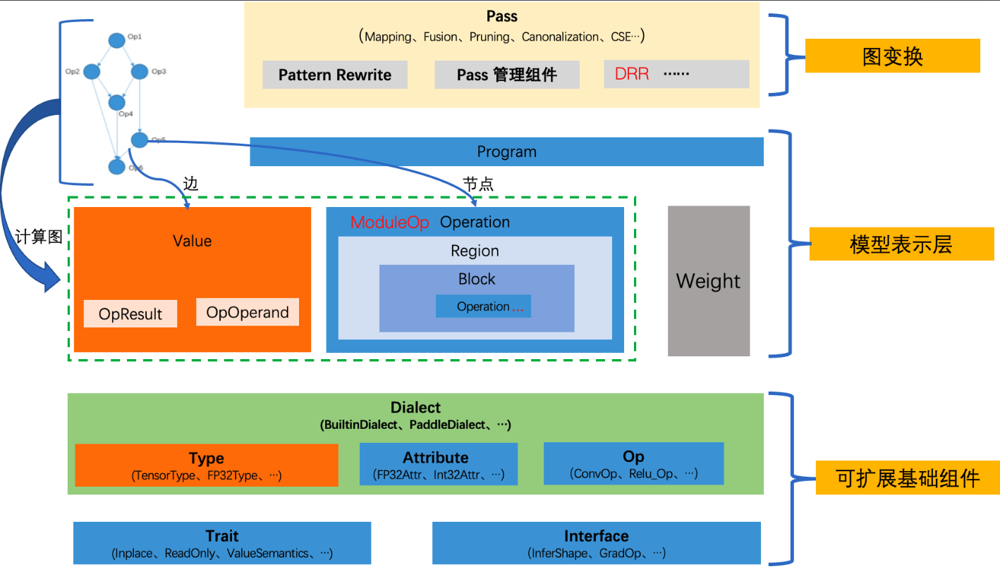
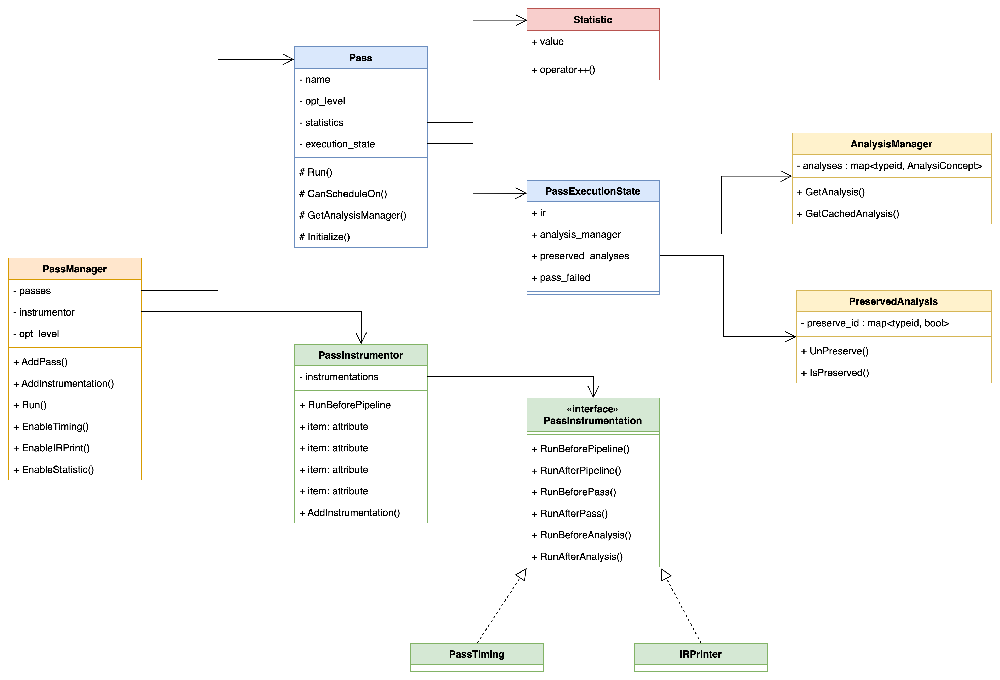
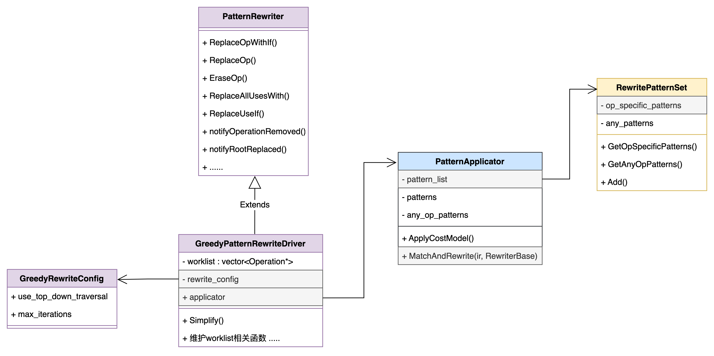
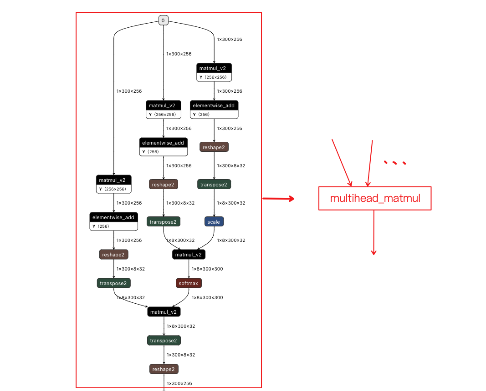

## 一、新 IR 长啥样？



#### 模型表示层

1. **Program** 用来表示一个具体的模型。它包含两部分：计算图和权重。Program 中包含 **Parameter** 和 **ModuleOp** 两个数据结构。
   1. Weight（Parameter）用来对模型的权重数据进行单独存储。
   2. ModuleOp 表示 Program 中的顶层 Operation。
2. **Value** 和 **Operation** 用来对计算图进行抽象，构成了严格符合 SSA 的 DAG。
   1. Operation 表示计算图中的节点。
   2. 一个 Operation 表示一个算子，它里面包含了零个或多个 Region。
   3. **Region** 表示一个闭包，它里面包含了零个或多个 Block。
   4. **Block** 表示一个符合 SSA 的基本块，里面包含了零个或多个 Operation。
   5. 三者循环嵌套，可以实现任意复杂的语法结构。
3. Value 表示计算图中的有向边，他用来将两个 Operaton 关联起来，描述了程序中的 UD 链。
   1. **OpResult** 表示定义端，定义了一个 Value。也就是 Operation 的输出。
   2. **OpOperand** 表示使用端，描述了对一个 Value 的使用。也就是 Operation 的输入。

#### 可扩展基础组件

1. **Dialect** 用来对 **Type**、**Attribtue**、**Op** 做模块化管理，包含了一系列的 Type、Attribtue、Op 的定义。
   1. **BuiltinDialect** 顾名思义内置的，概念上的标识。
      1. Operation：ModuleOp、GetParameterOp、CombineOp 等。
      2. Attribtue**：**StrAttribute、BoolAttribute、FloatAttribute 等。
      3. Type**：**DenseTensorType、BoolType、Float32Type 等。
   2. **PaddleDialect** 包含了所有 paddle op，如 MatmulOp、AddOp 等。
2. **Trait** 用来对特征进行抽象。这些 trait 标识可用于图优化和并行调度等。
   1. **InplaceTrait** 表示一个 Op 具有 Inplace 特征。
   2. **ReadOnlyTrait** 表示一个算子具有只读特征。
   3. **ValueSemanticsTrait** 表示一个算子具有值语意特征。
3. **Interface** 用来对接口进行抽象，它表示算子定义了某些函数接口。
   1. **InferShapeInterface** 表示一个算子定义了 InferShape 函数接口（有些则没有。可以通过InferShape 接口来标志算子是否存在 InferShape 函数）
   2. **GradInterface 表示一个算子定义了构造反向的函数接口。** 
4. 这三者都是可以任意扩展的，只要派生自相应的基类、遵循相应的实现规则即可。

#### Resnet50 IR 表示

- `builtin.get_parameter`：为新增类型算子，负责加载参数。
- `pd.feed`和`pd.fetch`：分别对应于输入数据读取和输出 Tensor 获取操作。
- `builtin op`：`builtin.constant`对应与旧体系的`fill_constant`，但放到了`builtin`命名空间。
- `pd.conv2d`和 `pd.conv2d_grad`：`pd.`命名空间下的算子，对应于 `PaddleDialect`下的算子体系。

```cpp
{
(%0) = "builtin.get_parameter" () {parameter_name:batch_norm_0.b_0} : () -> tensor<64xf32>
(%1) = "builtin.get_parameter" () {parameter_name:batch_norm_0.b_0_velocity_0} : () -> tensor<64xf32>
(%2) = "builtin.get_parameter" () {parameter_name:batch_norm_0.w_0} : () -> tensor<64xf32>
(%3) = "builtin.get_parameter" () {parameter_name:batch_norm_0.w_0_velocity_0} : () -> tensor<64xf32>
(%4) = "builtin.get_parameter" () {parameter_name:batch_norm_0.w_1} : () -> tensor<64xf32>
(%5) = "builtin.get_parameter" () {parameter_name:batch_norm_0.w_2} : () -> tensor<64xf32>
(%6) = "builtin.get_parameter" () {parameter_name:batch_norm_1.b_0} : () -> tensor<64xf32>
.....(省略)
(%429) = "pd.feed" () {name:label} : () -> tensor<-1x1xi64>
(%430) = "pd.feed" () {name:data} : () -> tensor<-1x3x224x224xf32>
.....(省略)
(%431) = "pd.conv2d" (%430, %318) {groups:1,padding_algorithm:EXPLICIT,strides:array[2,2],data_format:NCHW,dilations:array[1,1],paddings:array[3,3]} : (tensor<-1x3x224x224xf32>, tensor<64x3x7x7xf32>) -> tensor<-1x64x112x112xf32>
(%432, %433, %434, %435, %436, %437) = "pd.batch_norm" (%431, %4, %5, %2, %0) {trainable_statistics:0,use_global_stats:0,data_layout:NCHW,epsilon:1e-05,is_test:0,momentum:0.9} : (tensor<-1x64x112x112xf32>, tensor<64xf32>, tensor<64xf32>, tensor<64xf32>, tensor<64xf32>) -> tensor<-1x64x112x112xf32>, tensor<64xf32>, tensor<64xf32>, tensor<64xf32>, tensor<64xf32>, tensor<-1xf32>
(%438) = "pd.relu" (%432) {} : (tensor<-1x64x112x112xf32>) -> tensor<-1x64x112x112xf32>
(%439) = "builtin.constant" () {value:IntArray[3,3]} : () -> tensor<0x<<NULL TYPE>>>
(%440) = "pd.pool2d" (%438, %439) 
.....(省略)
(%1297, %1298, %1299) = "pd.merged_momentum_" (%1293, %1294, %1295, %1296, <<NULL VALUE>>) 
() = "pd.fetch" (%880) {name:mean_0.tmp_0} : (tensor<f32>) -> 
() = "pd.fetch" (%884) {name:accuracy_0.tmp_0} : (tensor<f32>) -> 
() = "pd.fetch" (%896) {name:accuracy_1.tmp_0} : (tensor<f32>) -> 
```

#### 新 IR 中 Op 定义

1. 通过 yaml 配置，代码自动生成
   1. build/paddle/fluid/ir/dialect/paddle_dialect/ir/pd_op.h
   2. build/paddle/fluid/ir/dialect/paddle_dialect/ir/pd_op.cc
2. 手写
   1. paddle/fluid/ir/dialect/paddle_dialect/ir/pd_manual_op.h
   2. paddle/fluid/ir/dialect/paddle_dialect/ir/pd_manual_op.cc

```cpp
- op : matmul
  args : (Tensor x, Tensor y, bool transpose_x = false, bool transpose_y = false)
  output : Tensor
  infer_meta :
    func : MatmulInferMeta
  kernel :
    func : matmul
  backward : matmul_grad
class MatmulOp : public ir::Op<MatmulOp,paddle::dialect::OpYamlInfoInterface, paddle::dialect::InferMetaInterface, paddle::dialect::VjpInterface> {
 public:
  using Op::Op;
  static const char *name() { return "pd.matmul"; }
  static const char *attributes_name[2];
  static constexpr uint32_t attributes_num = 2;
  static OpInfoTuple GetOpInfo();
  static void Build(ir::Builder &builder, ir::OperationArgument &argument, ir::OpResult x_, ir::OpResult y_, bool transpose_x=false, bool transpose_y=false);
  static void Build(ir::Builder &builder, ir::OperationArgument &argument, ir::OpResult x_, ir::OpResult y_, ir::AttributeMap attributes);
  void Verify();
  ir::Value x() { return operand_source(0); }
  ir::Value y() { return operand_source(1); }
  ir::OpResult out() { return result(0); }

  static void InferMeta( phi::InferMetaContext *infer_meta );
  static std::vector<std::vector<ir::OpResult>> Vjp(ir::Operation* op, const std::vector<std::vector<ir::OpResult>>& out_grads, const std::vector<std::vector<bool>>& stop_gradients);
};
const char *MatmulOp::attributes_name[2] = { "transpose_x", "transpose_y" };

OpInfoTuple MatmulOp::GetOpInfo() {
  std::vector<paddle::dialect::OpInputInfo> inputs = { paddle::dialect::OpInputInfo("x", "paddle::dialect::DenseTensorType", false, false, false, true), paddle::dialect::OpInputInfo("y", "paddle::dialect::DenseTensorType", false, false, false, true) };
  std::vector<paddle::dialect::OpAttributeInfo> attributes = { paddle::dialect::OpAttributeInfo("transpose_x", "ir::BoolAttribute", ""), paddle::dialect::OpAttributeInfo("transpose_y", "ir::BoolAttribute", "") };
  std::vector<paddle::dialect::OpOutputInfo> outputs = { paddle::dialect::OpOutputInfo("out", "paddle::dialect::DenseTensorType", false, false) };
  paddle::dialect::OpRunTimeInfo run_time_info = paddle::dialect::OpRunTimeInfo("MatmulInferMeta", {"x", "y", "transpose_x", "transpose_y"}, {"matmul"}, {"x", "y", "transpose_x", "transpose_y"}, {}, {}, {}, {});
  return std::make_tuple(inputs, attributes, outputs, run_time_info, "matmul");
}

void MatmulOp::Build(ir::Builder &builder, ir::OperationArgument &argument, ir::OpResult x_, ir::OpResult y_, bool transpose_x, bool transpose_y) {


  VLOG(4) << "Builder construction inputs";
  std::vector<ir::OpResult> argument_inputs = {x_, y_};
  argument.AddOperands(argument_inputs.begin(), argument_inputs.end());

  VLOG(4) << "Builder construction attributes";
  ir::Attribute attr_transpose_x = ir::BoolAttribute::get(ir::IrContext::Instance(), transpose_x);
  argument.AddAttribute("transpose_x", attr_transpose_x);
  ir::Attribute attr_transpose_y = ir::BoolAttribute::get(ir::IrContext::Instance(), transpose_y);
  argument.AddAttribute("transpose_y", attr_transpose_y);

  VLOG(4) << "Builder construction outputs";
  paddle::dialect::DenseTensorType x = x_.type().dyn_cast<paddle::dialect::DenseTensorType>(); (void)x;
  paddle::dialect::DenseTensorType y = y_.type().dyn_cast<paddle::dialect::DenseTensorType>(); (void)y;

  VLOG(4) << "Builder construction  dense_x";
  paddle::dialect::IrMetaTensor ir_meta_tensor_x(paddle::dialect::TransToPhiDataType(x.dtype()),
                                                      x.dims(),
                                                      x.data_layout(),
                                                      x.lod(),
                                                      x.offset());
  VLOG(4) << "Builder construction  meta_x";
  phi::MetaTensor meta_x(&ir_meta_tensor_x);

  VLOG(4) << "Builder construction  dense_y";
  paddle::dialect::IrMetaTensor ir_meta_tensor_y(paddle::dialect::TransToPhiDataType(y.dtype()),
                                                      y.dims(),
                                                      y.data_layout(),
                                                      y.lod(),
                                                      y.offset());
  VLOG(4) << "Builder construction  meta_y";
  phi::MetaTensor meta_y(&ir_meta_tensor_y);
  phi::DenseTensor dense_out;
  phi::MetaTensor meta_out(&dense_out);

  phi::MatmulInferMeta(meta_x, meta_y, transpose_x, transpose_y, &meta_out);

  std::vector<ir::Type> argument_outputs;
  ir::Type out_dense_tensor_type = paddle::dialect::DenseTensorType::get(ir::IrContext::Instance(), paddle::dialect::TransToIrDataType(dense_out.dtype()), dense_out.dims(), dense_out.layout(), dense_out.lod(), dense_out.offset());
  argument_outputs.push_back(out_dense_tensor_type);
  argument.AddOutputs(argument_outputs.begin(), argument_outputs.end());

}

void MatmulOp::Build(ir::Builder &builder, ir::OperationArgument &argument, ir::OpResult x_, ir::OpResult y_, ir::AttributeMap attributes) {
  bool transpose_x = attributes.at("transpose_x").dyn_cast<ir::BoolAttribute>().data();
  bool transpose_y = attributes.at("transpose_y").dyn_cast<ir::BoolAttribute>().data();

  VLOG(4) << "Builder construction inputs";
  std::vector<ir::OpResult> argument_inputs = {x_, y_};
  argument.AddOperands(argument_inputs.begin(), argument_inputs.end());

  VLOG(4) << "Builder construction attributes";
  ir::Attribute attr_transpose_x = ir::BoolAttribute::get(ir::IrContext::Instance(), transpose_x);
  argument.AddAttribute("transpose_x", attr_transpose_x);
  ir::Attribute attr_transpose_y = ir::BoolAttribute::get(ir::IrContext::Instance(), transpose_y);
  argument.AddAttribute("transpose_y", attr_transpose_y);

  VLOG(4) << "Builder construction outputs";
  paddle::dialect::DenseTensorType x = x_.type().dyn_cast<paddle::dialect::DenseTensorType>(); (void)x;
  paddle::dialect::DenseTensorType y = y_.type().dyn_cast<paddle::dialect::DenseTensorType>(); (void)y;

  VLOG(4) << "Builder construction  dense_x";
  paddle::dialect::IrMetaTensor ir_meta_tensor_x(paddle::dialect::TransToPhiDataType(x.dtype()),
                                                      x.dims(),
                                                      x.data_layout(),
                                                      x.lod(),
                                                      x.offset());
  VLOG(4) << "Builder construction  meta_x";
  phi::MetaTensor meta_x(&ir_meta_tensor_x);

  VLOG(4) << "Builder construction  dense_y";
  paddle::dialect::IrMetaTensor ir_meta_tensor_y(paddle::dialect::TransToPhiDataType(y.dtype()),
                                                      y.dims(),
                                                      y.data_layout(),
                                                      y.lod(),
                                                      y.offset());
  VLOG(4) << "Builder construction  meta_y";
  phi::MetaTensor meta_y(&ir_meta_tensor_y);
  phi::DenseTensor dense_out;
  phi::MetaTensor meta_out(&dense_out);

  phi::MatmulInferMeta(meta_x, meta_y, transpose_x, transpose_y, &meta_out);

  std::vector<ir::Type> argument_outputs;
  ir::Type out_dense_tensor_type = paddle::dialect::DenseTensorType::get(ir::IrContext::Instance(), paddle::dialect::TransToIrDataType(dense_out.dtype()), dense_out.dims(), dense_out.layout(), dense_out.lod(), dense_out.offset());
  argument_outputs.push_back(out_dense_tensor_type);
  argument.AddOutputs(argument_outputs.begin(), argument_outputs.end());

}

void MatmulOp::Verify() {
  VLOG(4) << "Start Verifying inputs, outputs and attributes for: MatmulOp.";
  VLOG(4) << "Verifying inputs:";
  {
  auto input_size = num_operands();
  PADDLE_ENFORCE_EQ(input_size, 2u,
                    phi::errors::PreconditionNotMet("The size %d of inputs must be equal to 2.", input_size));
  PADDLE_ENFORCE((*this)->operand_source(0).type().isa<paddle::dialect::DenseTensorType>(),
                  phi::errors::PreconditionNotMet("Type validation failed for the 0th input."));
  PADDLE_ENFORCE((*this)->operand_source(1).type().isa<paddle::dialect::DenseTensorType>(),
                  phi::errors::PreconditionNotMet("Type validation failed for the 1th input."));
  }
  VLOG(4) << "Verifying attributes:";
  {
  auto& attributes = this->attributes();
  PADDLE_ENFORCE(attributes.count("transpose_x")>0 && attributes.at("transpose_x").isa<ir::BoolAttribute>(),
                 phi::errors::PreconditionNotMet("Type of attribute: transpose_x is not right."));
  PADDLE_ENFORCE(attributes.count("transpose_y")>0 && attributes.at("transpose_y").isa<ir::BoolAttribute>(),
                 phi::errors::PreconditionNotMet("Type of attribute: transpose_y is not right."));
  }
  VLOG(4) << "Verifying outputs:";
  {
  auto output_size = num_results();
  PADDLE_ENFORCE_EQ(output_size, 1u,
                    phi::errors::PreconditionNotMet("The size %d of outputs must be equal to 1.", output_size));
  PADDLE_ENFORCE((*this)->result(0).type().isa<paddle::dialect::DenseTensorType>(),
                 phi::errors::PreconditionNotMet("Type validation failed for the 0th output."));
  }
  VLOG(4) << "End Verifying for: MatmulOp.";
}

void MatmulOp::InferMeta( phi::InferMetaContext *infer_meta ) {
  auto fn = PD_INFER_META(phi::MatmulInferMeta);
  fn(infer_meta);
}
```

## 二、新Pass体系简介




|  |  |
| ------------------------------------------------------------ | ------------------------------------------------------------ |
| PatternRewrite模块UML                                        |                                                              |

#### 如何写 “裸写 IR” Pass?

```cpp
class DeadCodeEliminationPass : public ir::Pass {
 public:
  DeadCodeEliminationPass() : ir::Pass("dead_code_elimination", 0) {}

  void Run(ir::Operation *op) override {
    auto module_op = op->dyn_cast<ir::ModuleOp>();
    IR_ENFORCE(module_op, "DcePass should run on module op.");
    auto *block = module_op.block();
    std::vector<ir::Operation *> erased_op;
    for (auto &op : *block) {
      bool use_empty = true;
      for (uint32_t i = 0; i < op->num_results(); ++i) {
        use_empty &= op->result(i).use_empty();
      }
      // TODO(wilber): Support Terminator trait.
      // if (use_empty && !op->HasTrait<TerminatorTrait>()) {
      if (use_empty && op->name() != "pd.fetch") {
        erased_op.push_back(op);
      }
    }

    for (auto *op : erased_op) {
      if (op->dyn_cast<ir::GetParameterOp>()) {
        // Delete parameter from program.
        ir::GetParameterOp get_parameter_op =
            op->dyn_cast<ir::GetParameterOp>();
        get_parameter_op->GetParentProgram()->parameters().erase(
            get_parameter_op->attributes()
                .at(get_parameter_op.attributes_name[0])
                .dyn_cast<ir::StrAttribute>()
                .AsString());
      }
      block->erase(*op);
    }
  }

  bool CanApplyOn(ir::Operation *op) const override {
    return op->name() == "builtin.module" && op->num_regions() > 0;
  }
};
```

#### 如何写融合 Pass ？

**示例一：匹配两个级联的 transpose op，用一个新的 transpose op 取代。**

step 1: 基于 DRR 描述一个 PatternRewrite 规则，实现一个 RemoveRedundentTransposePattern。

```cpp
class RemoveRedundentTransposePattern
    : public ir::drr::DrrPatternBase<RemoveRedundentTransposePattern> {
 public:
  void operator()(ir::drr::DrrPatternContext *ctx) const override {
    // Source pattern: 待匹配的子图
    ir::drr::SourcePattern pat = ctx->SourcePattern();
    const auto &transpose1 =
        pat.Op("pd.transpose", {{"perm", pat.Attr("perm_1")}});
    const auto &transpose2 =
        pat.Op("pd.transpose", {{"perm", pat.Attr("perm_2")}});

    pat.Tensor("ret") = transpose2(transpose1(pat.Tensor("arg_transpose")));

    // Result patterns: 要替换的子图
    ir::drr::ResultPattern res = pat.ResultPattern();
    const auto &new_perm_attr = res.Attr(
        [](const ir::drr::MatchContext &match_ctx) -> std::vector<int> {
          const auto &perm1 = match_ctx.Attr<std::vector<int>>("perm_1");
          const auto &perm2 = match_ctx.Attr<std::vector<int>>("perm_2");
          std::vector<int> new_perm;
          for (int v : perm2) {
            new_perm.emplace_back(perm1[v]);
          }
          return new_perm;
        });
    const auto &tranpose_continuous =
        res.Op("pd.transpose", {{"perm", new_perm_attr}});

    res.Tensor("ret") = tranpose_continuous(res.Tensor("arg_transpose"));
  }
};
```

step 2: 实现一个 RemoveRedundentTransposePass，将 RemoveRedundentTransposePattern 加入可以被 RemoveRedundentTransposePass 执行的 Pattern 列表。

```cpp
class RemoveRedundentTransposePass : public ir::Pass {
 public:
  TestPass() : ir::Pass("RemoveRedundentTransposePass", 1) {}

  bool Initialize(ir::IrContext *context) override {
    ir::RewritePatternSet ps(context);
    ps.Add<RemoveRedundentTransposePattern>(context);
    patterns_ = ir::FrozenRewritePatternSet(std::move(ps));
    return true;
  }

  void Run(ir::Operation *op) override {
    ir::GreedyRewriteConfig cfg;
    cfg.use_top_down_traversal = true;
    cfg.max_iterations = 10;
    ir::ApplyPatternsGreedily(op->region(0), patterns_, cfg);
  }

  bool CanApplyOn(ir::Operation *op) const override {
    return op->name() == "builtin.module" && op->num_regions() > 0;
  }

 private:
  ir::FrozenRewritePatternSet patterns_;
};
```

step 3: 将 RemoveRedundentTransposePass 放入 PassManager 去 Run。

```cpp
ir::PassManager pm(ctx);
pm.AddPass(std::make_unique<RemoveRedundentTransposePass>());
pm.Run(&program);
```

看下结果：

```cpp
332: ===-------------------------------------------------------------------------===
332:          IRPrinting on builtin.module before DrrPatternRewritePass pass
332: ===-------------------------------------------------------------------------===
332: {
332:  (%0) = "pd.full" () {dtype:float32,place:Place(cpu),shape:IntArray[4,3,16],value:1.5} : () -> pd.tensor<4x3x16xf32>
332:  (%1) = "pd.full_int_array" () {dtype:float32,place:Place(cpu),value:IntArray[4,3,16,16]} : () -> pd.tensor<4xf32>
332:  (%2) = "pd.expand" (%0, %1) {} : (pd.tensor<4x3x16xf32>, pd.tensor<4xf32>) -> pd.tensor<4x3x16x16xf32>
332:  (%3) = "pd.full_int_array" () {dtype:int64,place:Place(cpu),value:IntArray[16,3,4,16]} : () -> pd.tensor<4xi64>
332:  (%4, %5) = "pd.reshape" (%2, %3) {} : (pd.tensor<4x3x16x16xf32>, pd.tensor<4xi64>) -> pd.tensor<16x3x4x16xf32>, pd.tensor<0x4x3x16x16xf32>
332:  (%6) = "pd.full_int_array" () {dtype:int64,place:Place(cpu),value:IntArray[16,3,4,16]} : () -> pd.tensor<4xi64>
332:  (%7, %8) = "pd.reshape" (%4, %6) {} : (pd.tensor<16x3x4x16xf32>, pd.tensor<4xi64>) -> pd.tensor<16x3x4x16xf32>, pd.tensor<0x16x3x4x16xf32>
332:  (%9) = "pd.relu" (%7) {} : (pd.tensor<16x3x4x16xf32>) -> pd.tensor<16x3x4x16xf32>
332:  (%10) = "pd.cast" (%9) {dtype:float64} : (pd.tensor<16x3x4x16xf32>) -> pd.tensor<16x3x4x16xf64>
332:  (%11) = "pd.cast" (%10) {dtype:float32} : (pd.tensor<16x3x4x16xf64>) -> pd.tensor<16x3x4x16xf32>
332:  (%12) = "pd.transpose" (%11) {perm:array[0,2,1,3]} : (pd.tensor<16x3x4x16xf32>) -> pd.tensor<16x4x3x16xf32>
332:  (%13) = "pd.transpose" (%12) {perm:array[1,0,2,3]} : (pd.tensor<16x4x3x16xf32>) -> pd.tensor<4x16x3x16xf32>
332:  (%14) = "pd.relu" (%13) {} : (pd.tensor<4x16x3x16xf32>) -> pd.tensor<4x16x3x16xf32>
332:  (%15) = "pd.fetch" (%14) {col:0,name:out} : (pd.tensor<4x16x3x16xf32>) -> pd.tensor<4x16x3x16xf32>
332: }
332: 
332: 
332: ===-------------------------------------------------------------------------===
332:          IRPrinting on builtin.module after DrrPatternRewritePass pass
332: ===-------------------------------------------------------------------------===
332: {
332:  (%0) = "pd.full" () {dtype:float32,place:Place(cpu),shape:IntArray[4,3,16,16],value:1.5} : () -> pd.tensor<4x3x16x16xf32>
332:  (%1) = "pd.full_int_array" () {dtype:int64,place:Place(cpu),value:IntArray[16,3,4,16]} : () -> pd.tensor<4xi64>
332:  (%2) = "pd.full_int_array" () {dtype:int64,place:Place(cpu),value:IntArray[16,3,4,16]} : () -> pd.tensor<4xi64>
332:  (%3, %4) = "pd.reshape" (%0, %2) {} : (pd.tensor<4x3x16x16xf32>, pd.tensor<4xi64>) -> pd.tensor<16x3x4x16xf32>, pd.tensor<0x4x3x16x16xf32>
332:  (%5) = "pd.relu" (%3) {} : (pd.tensor<16x3x4x16xf32>) -> pd.tensor<16x3x4x16xf32>
332:  (%6) = "pd.transpose" (%5) {perm:array[2,0,1,3]} : (pd.tensor<16x3x4x16xf32>) -> pd.tensor<4x16x3x16xf32>
332:  (%7) = "pd.relu" (%6) {} : (pd.tensor<4x16x3x16xf32>) -> pd.tensor<4x16x3x16xf32>
332:  (%8) = "pd.fetch" (%7) {col:0,name:out} : (pd.tensor<4x16x3x16xf32>) -> pd.tensor<4x16x3x16xf32>
332: }
```

**示例二：multihead_matmul_fuse_pass**



```cpp
333: {
333:  (%0) = "pd.full" () {dtype:float32,place:Place(cpu),shape:IntArray[1,300,256],value:0.9} : () -> pd.tensor<1x300x256xf32>
333:  (%1) = "pd.full" () {dtype:float32,place:Place(cpu),shape:IntArray[256,256],value:1.1} : () -> pd.tensor<256x256xf32>
333:  (%2) = "pd.matmul" (%0, %1) {transpose_x:0,transpose_y:0} : (pd.tensor<1x300x256xf32>, pd.tensor<256x256xf32>) -> pd.tensor<1x300x256xf32>
333:  (%3) = "pd.full" () {dtype:float32,place:Place(cpu),shape:IntArray[256],value:1.5} : () -> pd.tensor<256xf32>
333:  (%4) = "pd.add" (%2, %3) {} : (pd.tensor<1x300x256xf32>, pd.tensor<256xf32>) -> pd.tensor<1x300x256xf32>
333:  (%5) = "pd.full_int_array" () {dtype:int64,place:Place(cpu),value:IntArray[0,0,8,32]} : () -> pd.tensor<4xi64>
333:  (%6, %7) = "pd.reshape" (%4, %5) {} : (pd.tensor<1x300x256xf32>, pd.tensor<4xi64>) -> pd.tensor<1x300x8x32xf32>, pd.tensor<0x1x300x256xf32>
333:  (%8) = "pd.transpose" (%6) {perm:array[0,2,1,3]} : (pd.tensor<1x300x8x32xf32>) -> pd.tensor<1x8x300x32xf32>
333:  (%9) = "pd.full" () {dtype:float32,place:Place(cpu),shape:IntArray[1],value:0.176777} : () -> pd.tensor<1xf32>
333:  (%10) = "pd.scale" (%8, %9) {bias:0,bias_after_scale:1} : (pd.tensor<1x8x300x32xf32>, pd.tensor<1xf32>) -> pd.tensor<1x8x300x32xf32>
333:  (%11) = "pd.full" () {dtype:float32,place:Place(cpu),shape:IntArray[256,256],value:1.1} : () -> pd.tensor<256x256xf32>
333:  (%12) = "pd.matmul" (%0, %11) {transpose_x:0,transpose_y:0} : (pd.tensor<1x300x256xf32>, pd.tensor<256x256xf32>) -> pd.tensor<1x300x256xf32>
333:  (%13) = "pd.full" () {dtype:float32,place:Place(cpu),shape:IntArray[256],value:1.5} : () -> pd.tensor<256xf32>
333:  (%14) = "pd.add" (%12, %13) {} : (pd.tensor<1x300x256xf32>, pd.tensor<256xf32>) -> pd.tensor<1x300x256xf32>
333:  (%15) = "pd.full_int_array" () {dtype:int64,place:Place(cpu),value:IntArray[0,0,8,32]} : () -> pd.tensor<4xi64>
333:  (%16, %17) = "pd.reshape" (%14, %15) {} : (pd.tensor<1x300x256xf32>, pd.tensor<4xi64>) -> pd.tensor<1x300x8x32xf32>, pd.tensor<0x1x300x256xf32>
333:  (%18) = "pd.transpose" (%16) {perm:array[0,2,1,3]} : (pd.tensor<1x300x8x32xf32>) -> pd.tensor<1x8x300x32xf32>
333:  (%19) = "pd.full" () {dtype:float32,place:Place(cpu),shape:IntArray[256,256],value:1.1} : () -> pd.tensor<256x256xf32>
333:  (%20) = "pd.matmul" (%0, %19) {transpose_x:0,transpose_y:0} : (pd.tensor<1x300x256xf32>, pd.tensor<256x256xf32>) -> pd.tensor<1x300x256xf32>
333:  (%21) = "pd.full" () {dtype:float32,place:Place(cpu),shape:IntArray[256],value:1.5} : () -> pd.tensor<256xf32>
333:  (%22) = "pd.add" (%20, %21) {} : (pd.tensor<1x300x256xf32>, pd.tensor<256xf32>) -> pd.tensor<1x300x256xf32>
333:  (%23) = "pd.full_int_array" () {dtype:int64,place:Place(cpu),value:IntArray[0,0,8,32]} : () -> pd.tensor<4xi64>
333:  (%24, %25) = "pd.reshape" (%22, %23) {} : (pd.tensor<1x300x256xf32>, pd.tensor<4xi64>) -> pd.tensor<1x300x8x32xf32>, pd.tensor<0x1x300x256xf32>
333:  (%26) = "pd.transpose" (%24) {perm:array[0,2,1,3]} : (pd.tensor<1x300x8x32xf32>) -> pd.tensor<1x8x300x32xf32>
333:  (%27) = "pd.matmul" (%10, %18) {transpose_x:0,transpose_y:1} : (pd.tensor<1x8x300x32xf32>, pd.tensor<1x8x300x32xf32>) -> pd.tensor<1x8x300x300xf32>
333:  (%28) = "pd.full" () {dtype:float32,place:Place(cpu),shape:IntArray[1,8,300,300],value:1.5} : () -> pd.tensor<1x8x300x300xf32>
333:  (%29) = "pd.add" (%27, %28) {} : (pd.tensor<1x8x300x300xf32>, pd.tensor<1x8x300x300xf32>) -> pd.tensor<1x8x300x300xf32>
333:  (%30) = "pd.softmax" (%29) {axis:-1} : (pd.tensor<1x8x300x300xf32>) -> pd.tensor<1x8x300x300xf32>
333:  (%31) = "pd.matmul" (%30, %26) {transpose_x:0,transpose_y:0} : (pd.tensor<1x8x300x300xf32>, pd.tensor<1x8x300x32xf32>) -> pd.tensor<1x8x300x32xf32>
333:  (%32) = "pd.transpose" (%31) {perm:array[0,2,1,3]} : (pd.tensor<1x8x300x32xf32>) -> pd.tensor<1x300x8x32xf32>
333:  (%33) = "pd.full_int_array" () {dtype:int64,place:Place(cpu),value:IntArray[0,0,256]} : () -> pd.tensor<3xi64>
333:  (%34, %35) = "pd.reshape" (%32, %33) {} : (pd.tensor<1x300x8x32xf32>, pd.tensor<3xi64>) -> pd.tensor<1x300x256xf32>, pd.tensor<0x1x300x8x32xf32>
333:  (%36) = "pd.fetch" (%34) {col:0,name:out} : (pd.tensor<1x300x256xf32>) -> pd.tensor<1x300x256xf32>
333: }
```
```cpp
- op : multihead_matmul
  args : (Tensor input, Tensor w, Tensor bias, Tensor bias_qk, bool transpose_q = false, bool transpose_k = true, bool transpose_v = false, float alpha = 1.0f, int head_number = 1)
  output : Tensor(out)
  infer_meta :
    func : MultiheadMatmulInferMeta
  kernel :
    func : multihead_matmul
    data_type : input
  optional : bias_qk
```
```cpp
class MultiheadMatmulOp : public ir::Op<MultiheadMatmulOp,paddle::dialect::OpYamlInfoInterface,paddle::dialect::InferMetaInterface> {
 public:
  using Op::Op;
  static const char *name() { return "pd.multihead_matmul"; }
  static const char *attributes_name[5];
  static constexpr uint32_t attributes_num = 5;
  static OpInfoTuple GetOpInfo();
  static void Build(ir::Builder &builder, ir::OperationArgument &argument, ir::OpResult input_, ir::OpResult w_, ir::OpResult bias_, ir::OpResult bias_qk_, bool transpose_q=false, bool transpose_k=true, bool transpose_v=false, float alpha=1.0f, int head_number=1);
  
  static void Build(ir::Builder &builder, ir::OperationArgument &argument, ir::OpResult input_, ir::OpResult w_, ir::OpResult bias_, ir::OpResult bias_qk_, ir::AttributeMap attributes);
  void Verify();
  ir::Value input() { return operand_source(0); }
  ir::Value w() { return operand_source(1); }
  ir::Value bias() { return operand_source(2); }
  ir::Value bias_qk() { return operand_source(3); }
  ir::OpResult out() { return result(0); }

  static void InferMeta( phi::InferMetaContext *infer_meta );
};
```
```cpp
class MultiHeadMatmulFusePattern
    : public ir::drr::DrrPatternBase<MultiHeadMatmulFusePattern> {
 public:
  void operator()(ir::drr::DrrPatternContext *ctx) const override {
    //
    // Source Pattern.
    //
    ir::drr::SourcePattern src = ctx->SourcePattern();
    // The first path to matmul with scale (q).
    const auto &matmul_1 =
        src.Op("pd.matmul",
               {{"transpose_x", src.Attr("matmul_1_transpose_x")},
                {"transpose_y", src.Attr("matmul_1_transpose_y")}});
    src.Tensor("matmul_1_out") =
        matmul_1(src.Tensor("matmul_1_in_1"), src.Tensor("matmul_1_in_2"));
    const auto &add_1 = src.Op("pd.add");
    src.Tensor("add_1_out") =
        add_1(src.Tensor("matmul_1_out"), src.Tensor("add_1_in_2"));
    const auto &full_int_array_1 = src.Op(
        "pd.full_int_array", {{"value", src.Attr("full_int_array_1_value")}});
    const auto &reshape_1 = src.Op("pd.reshape");
    reshape_1({&src.Tensor("add_1_out"), &full_int_array_1()},
              {&src.Tensor("reshape_1_out"), &src.Tensor("reshape_1_xshape")});
    const auto &transpose_1 = src.Op("pd.transpose");
    src.Tensor("transpose_1_out") = transpose_1(src.Tensor("reshape_1_out"));
    const auto &full_1 =
        src.Op("pd.full", {{"value", src.Attr("full_1_value")}});
    const auto &scale = src.Op("pd.scale");
    src.Tensor("scale_out") = scale(src.Tensor("transpose_1_out"), full_1());

    // The second path to matmul (k).
    const auto &matmul_2 =
        src.Op("pd.matmul",
               {{"transpose_x", src.Attr("matmul_2_transpose_x")},
                {"transpose_y", src.Attr("matmul_2_transpose_y")}});
    src.Tensor("matmul_2_out") =
        matmul_2(src.Tensor("matmul_1_in_1"), src.Tensor("matmul_2_in_2"));
    const auto &add_2 = src.Op("pd.add");
    src.Tensor("add_2_out") =
        add_2(src.Tensor("matmul_2_out"), src.Tensor("add_2_in_2"));
    const auto &full_int_array_2 = src.Op("pd.full_int_array");
    const auto &reshape_2 = src.Op("pd.reshape");
    reshape_2({&src.Tensor("add_2_out"), &full_int_array_2()},
              {&src.Tensor("reshape_2_out"), &src.Tensor("reshape_2_xshape")});
    const auto &transpose_2 = src.Op("pd.transpose");
    src.Tensor("transpose_2_out") = transpose_2(src.Tensor("reshape_2_out"));

    // The third path to matmul (v).
    const auto &matmul_3 =
        src.Op("pd.matmul",
               {{"transpose_x", src.Attr("matmul_3_transpose_x")},
                {"transpose_y", src.Attr("matmul_3_transpose_y")}});
    src.Tensor("matmul_3_out") =
        matmul_3(src.Tensor("matmul_1_in_1"), src.Tensor("matmul_3_in_2"));
    const auto &add_3 = src.Op("pd.add");
    src.Tensor("add_3_out") =
        add_3(src.Tensor("matmul_3_out"), src.Tensor("add_3_in_2"));
    const auto &full_int_array_3 = src.Op("pd.full_int_array");
    const auto &reshape_3 = src.Op("pd.reshape");
    reshape_3({&src.Tensor("add_3_out"), &full_int_array_3()},
              {&src.Tensor("reshape_3_out"), &src.Tensor("reshape_3_xshape")});
    const auto &transpose_3 = src.Op("pd.transpose");
    src.Tensor("transpose_3_out") = transpose_3(src.Tensor("reshape_3_out"));

    // softmax(qk)v
    const auto &matmul_4 =
        src.Op("pd.matmul",
               {{"transpose_x", src.Attr("matmul_4_transpose_x")},
                {"transpose_y", src.Attr("matmul_4_transpose_y")}});
    src.Tensor("matmul_4_out") =
        matmul_4(src.Tensor("scale_out"), src.Tensor("transpose_2_out"));
    const auto &add_4 = src.Op("pd.add");
    src.Tensor("add_4_out") =
        add_4(src.Tensor("matmul_4_out"), src.Tensor("add_4_in_2"));
    const auto &softmax =
        src.Op("pd.softmax", {{"axis", src.Attr("softmax_axis")}});
    src.Tensor("softmax_out") = softmax(src.Tensor("add_4_out"));
    const auto &matmul_5 =
        src.Op("pd.matmul",
               {{"transpose_x", src.Attr("matmul_5_transpose_x")},
                {"transpose_y", src.Attr("matmul_5_transpose_y")}});
    src.Tensor("matmul_5_out") =
        matmul_5(src.Tensor("softmax_out"), src.Tensor("transpose_3_out"));
    const auto &transpose_4 = src.Op("pd.transpose");
    src.Tensor("transpose_4_out") = transpose_4(src.Tensor("matmul_5_out"));
    const auto &full_int_array_4 = src.Op("pd.full_int_array");
    const auto &reshape_4 = src.Op("pd.reshape");
    reshape_4({&src.Tensor("transpose_4_out"), &full_int_array_4()},
              {&src.Tensor("reshape_4_out"), &src.Tensor("reshape_4_xshape")});

    //
    // Constraints.
    //
    src.RequireNativeCall([](const ir::drr::MatchContext &match_ctx) -> bool {
      const auto &softmax_axis = match_ctx.Attr<int>("softmax_axis");
      if (softmax_axis != -1 && softmax_axis != 3) return false;

      bool matmul_1_transpose_x = match_ctx.Attr<bool>("matmul_1_transpose_x");
      bool matmul_1_transpose_y = match_ctx.Attr<bool>("matmul_1_transpose_y");
      if (matmul_1_transpose_x || matmul_1_transpose_y) return false;

      bool matmul_2_transpose_x = match_ctx.Attr<bool>("matmul_2_transpose_x");
      bool matmul_2_transpose_y = match_ctx.Attr<bool>("matmul_2_transpose_y");
      if (matmul_2_transpose_x || matmul_2_transpose_y) return false;

      bool matmul_3_transpose_x = match_ctx.Attr<bool>("matmul_3_transpose_x");
      bool matmul_3_transpose_y = match_ctx.Attr<bool>("matmul_3_transpose_y");
      if (matmul_3_transpose_x || matmul_3_transpose_y) return false;

      bool matmul_4_transpose_x = match_ctx.Attr<bool>("matmul_4_transpose_x");
      bool matmul_4_transpose_y = match_ctx.Attr<bool>("matmul_4_transpose_y");
      if (matmul_4_transpose_x || !matmul_4_transpose_y) return false;

      bool matmul_5_transpose_x = match_ctx.Attr<bool>("matmul_5_transpose_x");
      bool matmul_5_transpose_y = match_ctx.Attr<bool>("matmul_5_transpose_y");
      if (matmul_5_transpose_x || matmul_5_transpose_y) return false;

      return true;
    });

    //
    // Result Pattern.
    //
    ir::drr::ResultPattern res = src.ResultPattern();
    // W combine.
    const auto &combine_1 = res.Op("builtin.combine");
    combine_1({&res.Tensor("matmul_1_in_2"),
               &res.Tensor("matmul_2_in_2"),
               &res.Tensor("matmul_3_in_2")},
              {&res.Tensor("combine_1_out")});
    const auto &concat_axis = res.Attr(
        [](const ir::drr::MatchContext &match_ctx) -> int { return 0; });
    const auto &concat_1 = res.Op("pd.concat", {{"axis", concat_axis}});
    res.Tensor("concat_1_out") = concat_1(res.Tensor("combine_1_out"));
    const auto &reshape_5_shape = res.Attr(
        [](const ir::drr::MatchContext &match_ctx) -> std::vector<int64_t> {
          auto matmul_1_in_2 = match_ctx.Tensor("matmul_1_in_2").Shape();
          return {-1, 3, matmul_1_in_2.at(1)};
        });
    const auto &reshape_5 = res.Op("pd.reshape", {{"shape", reshape_5_shape}});
    reshape_5({&res.Tensor("concat_1_out")},
              {&res.Tensor("reshape_5_out"), &res.NoneTensor()});

    // Bias combine.
    const auto &combine_2 = res.Op("builtin.combine");
    combine_2({&res.Tensor("add_1_in_2"),
               &res.Tensor("add_2_in_2"),
               &res.Tensor("add_3_in_2")},
              {&res.Tensor("combine_2_out")});
    const auto &concat_2 = res.Op("pd.concat", {{"axis", concat_axis}});
    res.Tensor("concat_2_out") = concat_2(res.Tensor("combine_2_out"));
    const auto &reshape_6_shape = res.Attr(
        [](const ir::drr::MatchContext &match_ctx) -> std::vector<int64_t> {
          return {3, -1};
        });
    const auto &reshape_6 = res.Op("pd.reshape", {{"shape", reshape_6_shape}});
    reshape_6({&res.Tensor("concat_2_out")},
              {&res.Tensor("reshape_6_out"), &res.NoneTensor()});

    const auto &head_number =
        res.Attr([](const ir::drr::MatchContext &match_ctx) -> int {
          const auto &full_int_array_1_value =
              match_ctx.Attr<std::vector<int64_t>>("full_int_array_1_value");
          return full_int_array_1_value.at(2);
        });
    const auto &alpha =
        res.Attr([](const ir::drr::MatchContext &match_ctx) -> float {
          return match_ctx.Attr<float>("full_1_value");
        });
    const auto &multihead_matmul =
        res.Op("pd.multihead_matmul",
               {{"head_number", head_number}, {"alpha", alpha}});
    multihead_matmul({&res.Tensor("matmul_1_in_1"),
                      &res.Tensor("reshape_5_out"),
                      &res.Tensor("reshape_6_out"),
                      &res.NonTensor()},
                     {&res.Tensor("reshape_4_out")});
  }
};

class AttentionFusePass : public ir::Pass {
 public:
  AttentionFusePass() : ir::Pass("AttentionFusePass", 1) {}

  bool Initialize(ir::IrContext *context) override {
    ir::RewritePatternSet ps(context);
    ps.Add(MultiHeadMatmulFusePattern().Build(context));
    // Add other attention variant fuse pattern.

    patterns_ = ir::FrozenRewritePatternSet(std::move(ps));
    return true;
  }

  void Run(ir::Operation *op) override {
    ir::GreedyRewriteConfig cfg;
    cfg.use_top_down_traversal = true;
    cfg.max_iterations = 10;
    ir::ApplyPatternsGreedily(op->region(0), patterns_, cfg);
  }

  bool CanApplyOn(ir::Operation *op) const override {
    return op->name() == "builtin.module" && op->num_regions() > 0;
  }

 private:
  ir::FrozenRewritePatternSet patterns_;
};

std::unique_ptr<Pass> CreateAttentionFusePass() {
  return std::make_unique<AttentionFusePass>();
}
```
```cpp
333: ===-------------------------------------------------------------------------===
333:            IRPrinting on builtin.module before AttentionFusePass pass
333: ===-------------------------------------------------------------------------===
333: {
333:  (%0) = "pd.full" () {dtype:float32,place:Place(cpu),shape:IntArray[1,300,256],value:0.9} : () -> pd.tensor<1x300x256xf32>
333:  (%1) = "pd.full" () {dtype:float32,place:Place(cpu),shape:IntArray[256,256],value:1.1} : () -> pd.tensor<256x256xf32>
333:  (%2) = "pd.matmul" (%0, %1) {transpose_x:0,transpose_y:0} : (pd.tensor<1x300x256xf32>, pd.tensor<256x256xf32>) -> pd.tensor<1x300x256xf32>
333:  (%3) = "pd.full" () {dtype:float32,place:Place(cpu),shape:IntArray[256],value:1.5} : () -> pd.tensor<256xf32>
333:  (%4) = "pd.add" (%2, %3) {} : (pd.tensor<1x300x256xf32>, pd.tensor<256xf32>) -> pd.tensor<1x300x256xf32>
333:  (%5) = "pd.full_int_array" () {dtype:int64,place:Place(cpu),value:IntArray[0,0,8,32]} : () -> pd.tensor<4xi64>
333:  (%6, %7) = "pd.reshape" (%4, %5) {} : (pd.tensor<1x300x256xf32>, pd.tensor<4xi64>) -> pd.tensor<1x300x8x32xf32>, pd.tensor<0x1x300x256xf32>
333:  (%8) = "pd.transpose" (%6) {perm:array[0,2,1,3]} : (pd.tensor<1x300x8x32xf32>) -> pd.tensor<1x8x300x32xf32>
333:  (%9) = "pd.full" () {dtype:float32,place:Place(cpu),shape:IntArray[1],value:0.176777} : () -> pd.tensor<1xf32>
333:  (%10) = "pd.scale" (%8, %9) {bias:0,bias_after_scale:1} : (pd.tensor<1x8x300x32xf32>, pd.tensor<1xf32>) -> pd.tensor<1x8x300x32xf32>
333:  (%11) = "pd.full" () {dtype:float32,place:Place(cpu),shape:IntArray[256,256],value:1.1} : () -> pd.tensor<256x256xf32>
333:  (%12) = "pd.matmul" (%0, %11) {transpose_x:0,transpose_y:0} : (pd.tensor<1x300x256xf32>, pd.tensor<256x256xf32>) -> pd.tensor<1x300x256xf32>
333:  (%13) = "pd.full" () {dtype:float32,place:Place(cpu),shape:IntArray[256],value:1.5} : () -> pd.tensor<256xf32>
333:  (%14) = "pd.add" (%12, %13) {} : (pd.tensor<1x300x256xf32>, pd.tensor<256xf32>) -> pd.tensor<1x300x256xf32>
333:  (%15) = "pd.full_int_array" () {dtype:int64,place:Place(cpu),value:IntArray[0,0,8,32]} : () -> pd.tensor<4xi64>
333:  (%16, %17) = "pd.reshape" (%14, %15) {} : (pd.tensor<1x300x256xf32>, pd.tensor<4xi64>) -> pd.tensor<1x300x8x32xf32>, pd.tensor<0x1x300x256xf32>
333:  (%18) = "pd.transpose" (%16) {perm:array[0,2,1,3]} : (pd.tensor<1x300x8x32xf32>) -> pd.tensor<1x8x300x32xf32>
333:  (%19) = "pd.full" () {dtype:float32,place:Place(cpu),shape:IntArray[256,256],value:1.1} : () -> pd.tensor<256x256xf32>
333:  (%20) = "pd.matmul" (%0, %19) {transpose_x:0,transpose_y:0} : (pd.tensor<1x300x256xf32>, pd.tensor<256x256xf32>) -> pd.tensor<1x300x256xf32>
333:  (%21) = "pd.full" () {dtype:float32,place:Place(cpu),shape:IntArray[256],value:1.5} : () -> pd.tensor<256xf32>
333:  (%22) = "pd.add" (%20, %21) {} : (pd.tensor<1x300x256xf32>, pd.tensor<256xf32>) -> pd.tensor<1x300x256xf32>
333:  (%23) = "pd.full_int_array" () {dtype:int64,place:Place(cpu),value:IntArray[0,0,8,32]} : () -> pd.tensor<4xi64>
333:  (%24, %25) = "pd.reshape" (%22, %23) {} : (pd.tensor<1x300x256xf32>, pd.tensor<4xi64>) -> pd.tensor<1x300x8x32xf32>, pd.tensor<0x1x300x256xf32>
333:  (%26) = "pd.transpose" (%24) {perm:array[0,2,1,3]} : (pd.tensor<1x300x8x32xf32>) -> pd.tensor<1x8x300x32xf32>
333:  (%27) = "pd.matmul" (%10, %18) {transpose_x:0,transpose_y:1} : (pd.tensor<1x8x300x32xf32>, pd.tensor<1x8x300x32xf32>) -> pd.tensor<1x8x300x300xf32>
333:  (%28) = "pd.full" () {dtype:float32,place:Place(cpu),shape:IntArray[1,8,300,300],value:1.5} : () -> pd.tensor<1x8x300x300xf32>
333:  (%29) = "pd.add" (%27, %28) {} : (pd.tensor<1x8x300x300xf32>, pd.tensor<1x8x300x300xf32>) -> pd.tensor<1x8x300x300xf32>
333:  (%30) = "pd.softmax" (%29) {axis:-1} : (pd.tensor<1x8x300x300xf32>) -> pd.tensor<1x8x300x300xf32>
333:  (%31) = "pd.matmul" (%30, %26) {transpose_x:0,transpose_y:0} : (pd.tensor<1x8x300x300xf32>, pd.tensor<1x8x300x32xf32>) -> pd.tensor<1x8x300x32xf32>
333:  (%32) = "pd.transpose" (%31) {perm:array[0,2,1,3]} : (pd.tensor<1x8x300x32xf32>) -> pd.tensor<1x300x8x32xf32>
333:  (%33) = "pd.full_int_array" () {dtype:int64,place:Place(cpu),value:IntArray[0,0,256]} : () -> pd.tensor<3xi64>
333:  (%34, %35) = "pd.reshape" (%32, %33) {} : (pd.tensor<1x300x8x32xf32>, pd.tensor<3xi64>) -> pd.tensor<1x300x256xf32>, pd.tensor<0x1x300x8x32xf32>
333:  (%36) = "pd.fetch" (%34) {col:0,name:out} : (pd.tensor<1x300x256xf32>) -> pd.tensor<1x300x256xf32>
333: }
333: 
333: 
333: ===-------------------------------------------------------------------------===
333:            IRPrinting on builtin.module after AttentionFusePass pass
333: ===-------------------------------------------------------------------------===
333: {
333:  (%0) = "pd.full" () {dtype:float32,place:Place(cpu),shape:IntArray[1,300,256],value:0.9} : () -> pd.tensor<1x300x256xf32>
333:  (%1) = "pd.full" () {dtype:float32,place:Place(cpu),shape:IntArray[256,256],value:1.1} : () -> pd.tensor<256x256xf32>
333:  (%2) = "pd.full" () {dtype:float32,place:Place(cpu),shape:IntArray[256],value:1.5} : () -> pd.tensor<256xf32>
333:  (%3) = "pd.full" () {dtype:float32,place:Place(cpu),shape:IntArray[256,256],value:1.1} : () -> pd.tensor<256x256xf32>
333:  (%4) = "pd.full" () {dtype:float32,place:Place(cpu),shape:IntArray[256],value:1.5} : () -> pd.tensor<256xf32>
333:  (%5) = "pd.full" () {dtype:float32,place:Place(cpu),shape:IntArray[256,256],value:1.1} : () -> pd.tensor<256x256xf32>
333:  (%6) = "pd.full" () {dtype:float32,place:Place(cpu),shape:IntArray[256],value:1.5} : () -> pd.tensor<256xf32>
333:  (%7) = "pd.full" () {dtype:float32,place:Place(cpu),shape:IntArray[1,8,300,300],value:1.5} : () -> pd.tensor<1x8x300x300xf32>
333:  (%8) = "builtin.combine" (%3, %1, %5) {} : (pd.tensor<256x256xf32>, pd.tensor<256x256xf32>, pd.tensor<256x256xf32>) -> vec[pd.tensor<256x256xf32>,pd.tensor<256x256xf32>,pd.tensor<256x256xf32>]
333:  (%9) = "builtin.combine" (%2, %4, %6) {} : (pd.tensor<256xf32>, pd.tensor<256xf32>, pd.tensor<256xf32>) -> vec[pd.tensor<256xf32>,pd.tensor<256xf32>,pd.tensor<256xf32>]
333:  (%10) = "pd.full" () {dtype:int32,place:Place(cpu),shape:IntArray[1],value:0} : () -> pd.tensor<1xi32>
333:  (%11) = "pd.concat" (%8, %10) {} : (vec[pd.tensor<256x256xf32>,pd.tensor<256x256xf32>,pd.tensor<256x256xf32>], pd.tensor<1xi32>) -> pd.tensor<768x256xf32>
333:  (%12) = "pd.full" () {dtype:int32,place:Place(cpu),shape:IntArray[1],value:0} : () -> pd.tensor<1xi32>
333:  (%13) = "pd.concat" (%9, %12) {} : (vec[pd.tensor<256xf32>,pd.tensor<256xf32>,pd.tensor<256xf32>], pd.tensor<1xi32>) -> pd.tensor<768xf32>
333:  (%14) = "pd.full_int_array" () {dtype:int64,place:Place(cpu),value:IntArray[-1,3,256]} : () -> pd.tensor<3xi64>
333:  (%15, %16) = "pd.reshape" (%11, %14) {} : (pd.tensor<768x256xf32>, pd.tensor<3xi64>) -> pd.tensor<256x3x256xf32>, pd.tensor<0x768x256xf32>
333:  (%17) = "pd.full_int_array" () {dtype:int64,place:Place(cpu),value:IntArray[3,-1]} : () -> pd.tensor<2xi64>
333:  (%18, %19) = "pd.reshape" (%13, %17) {} : (pd.tensor<768xf32>, pd.tensor<2xi64>) -> pd.tensor<3x256xf32>, pd.tensor<0x768xf32>
333:  (%20) = "pd.multihead_matmul" (%0, %15, %18, %7) {alpha:0.176777,head_number:8,transpose_k:1,transpose_q:0,transpose_v:0} : (pd.tensor<1x300x256xf32>, pd.tensor<256x3x256xf32>, pd.tensor<3x256xf32>, pd.tensor<1x8x300x300xf32>) -> pd.tensor<1x300x256xf32>
333:  (%21) = "pd.fetch" (%20) {col:0,name:out} : (pd.tensor<1x300x256xf32>) -> pd.tensor<1x300x256xf32>
333: }
```
